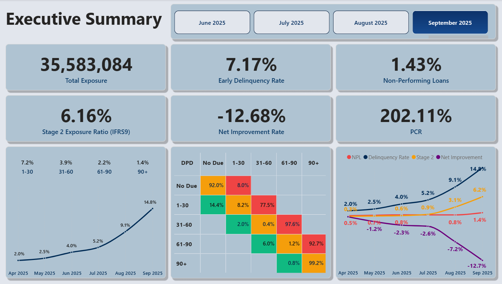
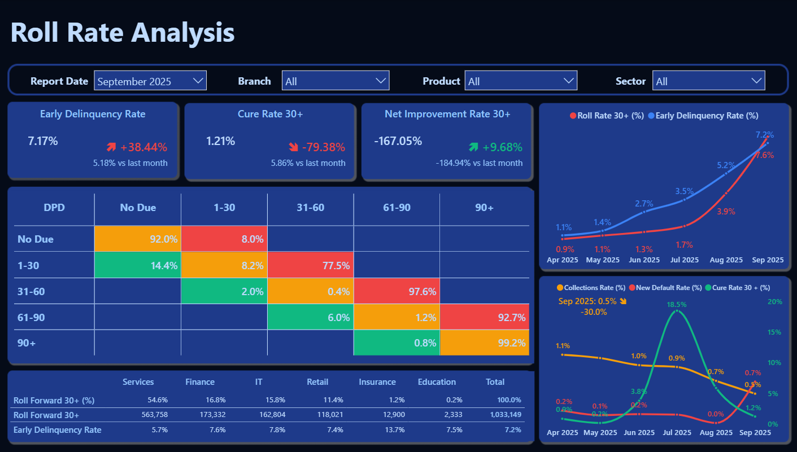
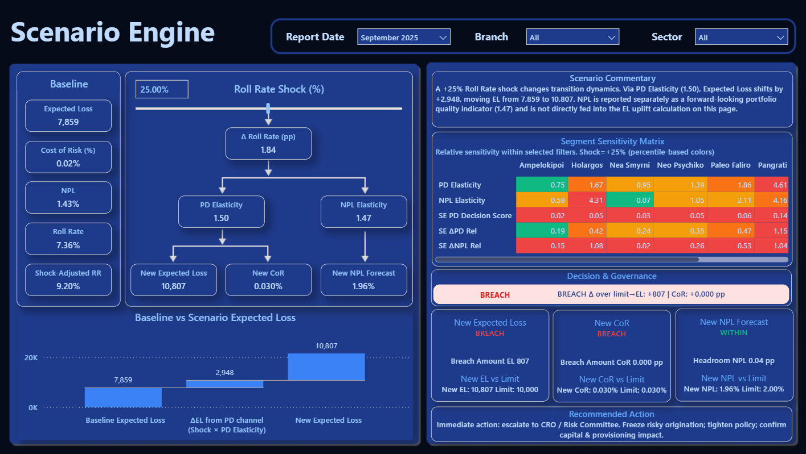
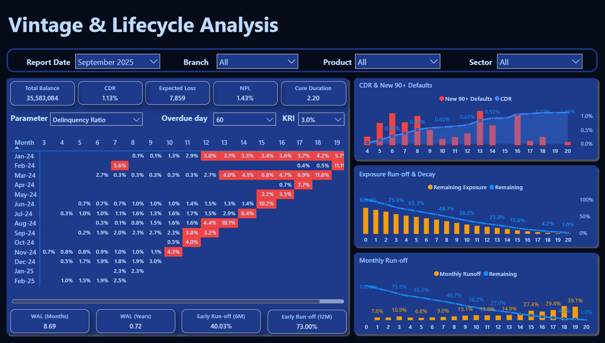
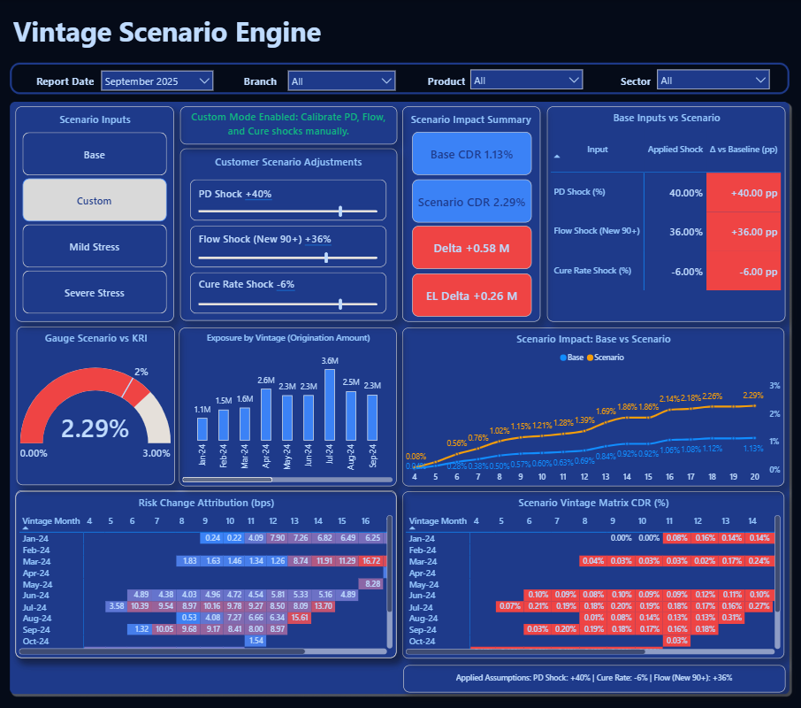

# Credit Risk – Roll Matrix Deep Analysis

**Production‑grade Power BI solution for vintage lifecycle, roll‑rate analysis and scenario stress testing (demo).**

---

## Quick pitch
A production‑grade Power BI platform that consolidates portfolio exposure, delinquency migration, vintage lifecycle analysis and scenario stress testing into a single IFRS‑9 aligned source of truth for risk teams and senior management.

> *Used by risk teams to quantify IFRS‑9 impacts, migration shocks, and provisioning sensitivity.*

---

## Video walkthrough
🎬 **Watch the comprehensive walkthrough and premium feature demonstration on YouTube:**  
👉 **[Credit Risk Analytics Suite – Full Video Demo](https://youtu.be/Yy1cQjsWr7Y)**

---

## Demo gallery

### Executive Overview

**Introducing the Credit Risk Analytics Suite** — a concise executive dashboard showing total exposure, NPL, PCR and month‑on‑month directional KPIs.

### Roll Rate Analysis

**Roll Rate Analysis** — exposure‑weighted 5×5 migration matrix, early delinquency inflows, cure rate and net improvement indicators.

### Roll Rate Scenario Engine

**Roll Rate Scenario Engine** — apply migration shocks and translate them into Expected Loss, Cost of Risk and NPL forecasts with waterfall decomposition.

### Vintage & Lifecycle Analysis

**Vintage & Lifecycle Analysis** — cohort CDR heatmaps, exposure run‑off, WAL and monthly run‑off metrics for origination cohorts.

### Vintage Scenario Engine

**Vintage Scenario Engine** — cohort‑level stress testing with PD, Flow and Cure shocks; scenario vs baseline deltas and risk attribution heatmaps.

👉 [View full demo PDF](credit-risk-roll-matrix-deep-analysis.pdf)

---

## What’s included (public demo)
- Demo preview PDF: [credit-risk-roll-matrix-deep-analysis.pdf](credit-risk-roll-matrix-deep-analysis.pdf)
- Executive summary and methodology summary in [docs/EXECUTIVE_SUMMARY.md](docs/EXECUTIVE_SUMMARY.md) and [docs/METHOD_NOTE_SUMMARY.md](docs/METHOD_NOTE_SUMMARY.md)

**Note:** The full commercial package (production PBIX, full documentation, commercial license) is available only after purchase. See [docs/COMMERCIAL_LICENSE.txt](docs/COMMERCIAL_LICENSE.txt) for a summary of license terms.

---

## How to buy
Purchase via: **[Gumroad – Credit Risk Roll Matrix Deep Analysis](https://isarijanli.gumroad.com/l/douysq)**  
After payment you will receive a secure download link and license file by email.

**Pilot offer:** first 3 buyers receive 15% discount and onboarding support in exchange for a short testimonial.

---

## Requirements & deployment notes
- Power BI Desktop 2024 or later to open PBIX.  
- Power BI Pro / Premium / Embedded depending on sharing and scale.  
- For tenant‑specific Embedded deployments, paid migration and onboarding services are available.

---

## License & legal
Public demo assets are for evaluation only. Full product distributed under a Commercial License. Redistribution or public posting of the full PBIX or documentation is prohibited.  
See [LICENSE_NOTICE.md](LICENSE_NOTICE.md) and [docs/COMMERCIAL_LICENSE.txt](docs/COMMERCIAL_LICENSE.txt) for license details.

---

## Contact
- Sales: [isarijanlibi@outlook.com](mailto:isarijanlibi@outlook.com)  
- Support: [isarijanlibi@outlook.com](mailto:isarijanlibi@outlook.com)

---

### © 2026 Credit Risk Analytics Suite  
*Developed for IFRS‑9 governance, capital planning and portfolio stress testing.*
